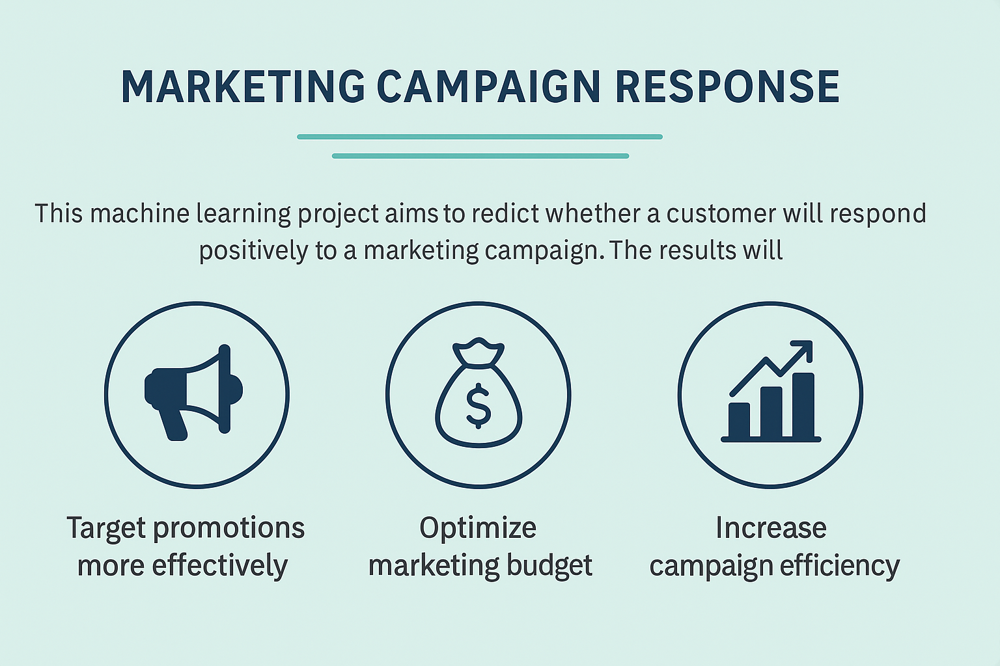

# Customer Response Prediction for Marketing Campaigns


<p align="center">
  
</p>
<p align="center">
  <!-- Deployment -->
  <a href="https://campaign-marketing.streamlit.app/" target="_blank">
    
  </a>
  <!-- Dataset -->
  <a href="https://www.kaggle.com/datasets/rodsaldanha/arketing-campaign" target="_blank">
    
  </a>
</p>

## Repository Outline
```
Customer-Response-Prediction-for-Marketing-Campaigns
│
├── /deployment                                  # Deployment packages for streamlit
│
├── marketing_cmp.csv                            # Raw dataset from kaggle
├── muhammad_al_ghifari_inference.ipynb          # Inference notebook
├── muhammad_al_ghifari_project.ipynb            # Main notebook
└── README.md                                    # Documentation
```

## Problem Background

<div align="justify">

FMCG International wants to improve marketing campaign effectiveness by targeting customers who are likely to respond positively. The dataset contains customer demographics, purchasing behavior, and participation in past campaigns. The main challenge is class imbalance between **responders (Response = 1)** and **non-responders (Response = 0)**. This project aims to build a prediction model that helps the marketing team identify high-potential customers more accurately so promotions are **better targeted**, **conversion rates increase**, and **budget allocation becomes more efficient**.

## Project Output

<div align="justify">

The output is a machine learning model that predicts the likelihood a customer will respond to a future campaign based on demographics, purchase behavior, and past campaign history. The model is integrated into a Streamlit dashboard that shows predictions, customer segmentation analysis, purchasing trends, and campaign acceptance rates.

## Data

<div align="justify">

The project uses the Marketing Campaign dataset from Kaggle (2,240 rows, 29 columns). It includes:

* **Customer demographics:** ID, year of birth, education, marital status, income, number of children/teens; engagement recency and first engagement date.

* **Purchasing behavior across product categories:** wine, meat, gold, fish, sweets, fruit.

* **Metrics:** purchases via discount, web, catalog, and store; monthly web visits.

* **Campaign response:** acceptance indicators for five prior campaigns and the most recent response.

* **Additional features:** customer complaints, contact costs and revenues, engineered age and tenure, total spending, and encoded demographic features.

## Method

<div align="justify">

A supervised learning approach is used to build a classification model that predicts campaign response from behavioral and demographic features. Models explored include **K-Nearest Neighbors (KNN)**, **Support Vector Machine (SVM)**, **Decision Tree**, **Random Forest**, and **Gradient Boosting**.

**Workflow:**

<div align="justify">

1. **Data preprocessing:** cleaning, handling missing values, feature encoding, and feature engineering (e.g., total spend, computed age).

2. **Exploratory Data Analysis (EDA):** distributions, feature correlations, and customer behavior patterns.

3. **Modeling & evaluation:** train–test split, evaluation via F1-Score and ROC-AUC to ensure balanced performance on both classes.

4. **The best-performing model is selected for inference and deployed in the dashboard.**

## Stacks

<div align="justify">

* **Python**, **VS Code**
* **pandas**, **numpy** — data wrangling & feature engineering  
* **matplotlib**, **seaborn** — EDA & visuals  
* **scipy.stats** — Mann–Whitney U, Chi-square / Fisher tests  
* **scikit-learn**  
  - preprocessing: **KNNImputer**, **RobustScaler**, **OneHot/OrdinalEncoder**  
  - models: **KNN**, **SVM**, **Decision Tree**, **Random Forest**, **Gradient Boosting**  
  - selection & metrics: **Pipeline**, **ColumnTransformer**, **StratifiedKFold**, **GridSearchCV**, **F1**, **ROC-AUC**, **Confusion Matrix**  
* **pickle** — model persistence  
* **Streamlit** — app & inference UI  
* **pip/conda** — environment & packages

## Reference

- [**How to Upsell & Cross-Sell: Proven Tactics + Examples**](https://www.shopify.com/blog/upselling-cross-selling)
- [**Classification Metrics**](https://scikit-learn.org/stable/modules/model_evaluation.html#classification-metrics)
- [**Gradient Boosting Classifier**](https://scikit-learn.org/stable/modules/generated/sklearn.ensemble.GradientBoostingClassifier.html)
- [**Precision–Recall Curve**](https://scikit-learn.org/stable/auto_examples/model_selection/plot_precision_recall.html)

---